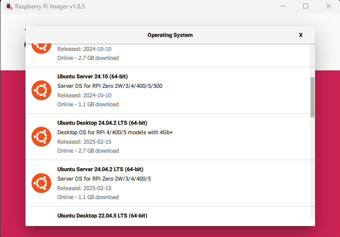

# Installation Manual


## 1 Introduction
This document is written as an installation guide to setup the software for the EQ mount. This guide assumes the user has some experience with setting up a raspberry PI and the user is familiar with embedded systems. Also does the guide assume that the user already has setup the hardware, because the hardware is not covered in this manual.


## 2 Operating system

### 2.1 Overview

First the Raspberry PI needs to be setup with an OS. Because the system will make use of ROS the type and version of the OS is very specific. The OS that is covered in this manual is Ubuntu Server 24.4 LTS 64 bit edition. This OS is tested and works. Other versions are not tested and the user can use them, but this manual will not advice it.

### 2.2 Downloading Raspberry Pi Imager

1. Before the user can flash ubuntu 24.04 onto a SD card, the Raspberry Pi Imager is needed. Download it from the <a href="https://www.raspberrypi.com/software/">Original website</a>.
```
https://www.raspberrypi.com/software/
```

2. When the image is downloaded, double click the imager and install it. 

3. Walk through the setup and install the program.

4. The imager tool is installed.

### 2.3 Flash Ubuntu 24.01 onto a SD card

1. Open the Raspberry Pi Imager tool.


2. Select under PI device the Raspberry PI 4b


3. Select under operating system: Ubuntu Server 24.04 64bit


4. Select under Storage your SD card


5. When the correct Storage device is chosen, press next.

6. The SD Card will flash.

## 3 Packages

### 3.1 Overview 

Before ROS 2 and the ROS 2 packages can be installed the system needs to be updated and additional linux packages needs to be installed. 

### 3.2 Connection to wifi

### 3.3 Update system

1. Run the following command to update the repositories on the system
```bash
sudo apt update
```

2. Run the following command to upgrade the installed packages
```bash
sudo apt upgrade
```

3. Updating the packages will take a while.

### 3.4 Installing additional packages

1. Make sure the correct repositories are on the system
```bash
sudo apt update
```

2. Install the GPIO packages
```

```

3. Install the 


## 3 ROS 

### 3.1 Overview

Before any 


## 4 GIT Repo

### 4.1 Overview

Installing the git repo will give the user access to the whole documentation and packages used in the system. The repo is available on github.

### 4.2 Install the git repo

1. First clone the repo with all it's submodules in the users project folder.
```bash
git clone --recurse-submodules https://github.com/nicoripkip/TINLABEmbedded.git
```

2. Navigate into the folder
```bash
cd TINLABEmbedded
```

3. Run the command colcon build. This will setup the folder as a ROS workspace.
```bash
colcon build
```

4. Navigate into the scripts folder.
```bash
cd scripts
```

5. Run the script to start all ROS nodes to operate the telescope
```bash
./run_nodes
```

6. Make sure to give sudo privileges to the script
```bash
*********
```